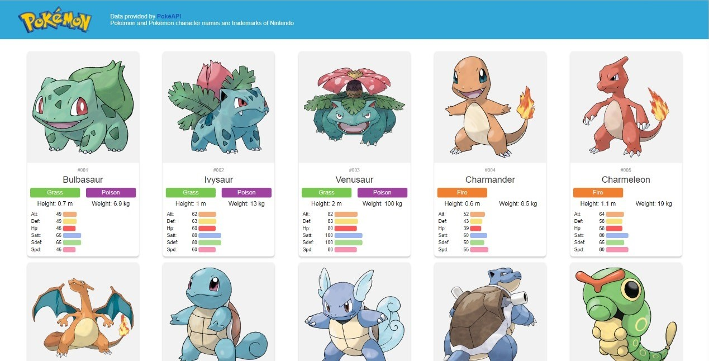

# Infinite Scrolling Pokédex

**Note: this project was submitted as my final project for CS50x 2022 on December 15.**

## Description

This is my final project for CS50x. It is an infinite scroller Pokédex application created with [Angular](https://angular.io/).

I wanted to create a simple Pokédex application displaying some information about each Pokémon and for it to be an infinite scroller, some Pokémon are initially loaded and as the user scrolls to the bottom of the page, more Pokémon get loaded.

### Angular

To create the application, I chose Angular, it was my first time using it. When researching tools, I saw that Angular is a complete framework with many functionalities bundled in and its CLI automates common activities. I felt that those advantages would allow me to be more productive.

### PokéAPI

For the Pokémon data required to make this application possible, I decided to use the [PokéAPI](https://pokeapi.co/). You can call the `/pokemon` endpoint with `limit` and `offset` query parameters (used for pagination) to get an array of results with URLs for specific Pokémon resources, those resources will have all the data for a specific Pokémon.

### Application files

When creating an Angular project, the CLI creates a skeleton with the basic files and folders to run an application, they can be modified to suit the need of the project. You can choose between “vanilla” CSS or between some CSS extension languages, I chose SASS for this project.

#### Configuration files

- `.editorconfig`: Configuration for the code editor.
- `.gitignore`: Specifies files that should not be tricked by Git.
- `angular.json`: CLI configuration defaults.
- `package.json`: Configures package dependencies.
- `package-lock.json`: Information about all packages installed.
- `README.md`: Angular creates a basic readme (I rewrote the whole file).
- `tsconfig.json`: Base TypeScript configuration.
- `tsconfig.app.json`: Application-specific TypeScript configuration.
- `tsconfig.spec.json`: TypeScript configuration for tests.

#### Application source files

The `src` folder contains all the files for testing and running the application:

- `assets`: Folder that contains images and possibly other assets.
- `favicon.ico`: Icon displayed in the browser tab.
- `index.html`: Main HTML page.
- `main.ts`: Main entry point of the application.
- `styles.sass`: Global styles for the project.
- `app`: Folder that contains the logic and data for the application.
  - `app.module.ts`: Root module of the application that describes how the application parts fit together and bootstraps the application.
  - `app.component`: The root component, the first component that is referenced and hosted.

#### Components

Components are the UI building blocks, every component has the same basic structure:

- `component.html`: Contains the visual structure.
- `component.sass`: Contains the style.
- `component.spec.ts`: Contains the unit tests.
- `component.ts`: Contains the class with the fields and methods for the logic.

For this application, the `components` folder contains all the components (excluding the root component). Those components are:

- `header.component`: The header of the application with the logo and some explanation/disclaimer text.
- `pokemon-card.component`: The card that displays the Pokémon information. It displays an image of the Pokémon, its number, its name, its type, its height and weight, and its stats with bars of different widths based on the value of each stat.
- `pokemon-list.component`: The container that gets the Pokémon data and passes it to the pokemon-card component. It has the logic for the infinite scroll, getting some Pokémon data when it loads and getting more as the user scrolls down.

#### Services

Services are used for tasks that don’t involve the UI, such as fetching data. They are composed of:

- `service.spec.ts`: Contains the unit tests.
- `service.ts`: Contains the class with the logic.

In the `services` folder, there is a `pokemon.service` (used by the pokemon-list component), it makes an initial call to the PokéAPI to get an array of results, it will then get the URLs from the results and make additional calls for each Pokémon resource, the Pokémon data is then returned.

#### Models

TypeScript interfaces that are used to type data. All models are inside the `models` folder, they are divided in:

- `all-pokemon`: Interfaces for the response of the PokéAPI with the array of results.
- `pokemon`: The data coming from the pokemon service is transformed in the pokemon-list component, to extract only the data needed, before being passed to the pokemon-card component. The interfaces here are used to type the transformed data.
- `single-pokemon`: Interfaces for the response of the PokéAPI for the single Pokémon resource.

### How to run it

#### Prerequisites

- Install [Node.js](https://nodejs.org/en/).
- Run `npm install` to install the project packages.

#### Run a development server

Run `npx ng serve -o` to start the development server and open the application on the default browser automatically, by default the application starts on `http://localhost:4200/`.

#### Run the unit tests

Angular comes ready for testing with [Jasmine](https://jasmine.github.io/) (testing framework) and [Karma](https://karma-runner.github.io/latest/index.html) (test runner). I wrote some unit tests for the components and service. Run `npx ng test` to run the unit tests.

#### Run a production build locally

- Run `npm install http-server -g` to install [http-server](https://www.npmjs.com/package/http-server).
- Run `npx ng build` to compile the application into the `dist` folder.
- Run `http-server dist/pokedex -o` to start the local server and open the application on the default browser automatically, by default the server starts on `http://localhost:8080/`.
